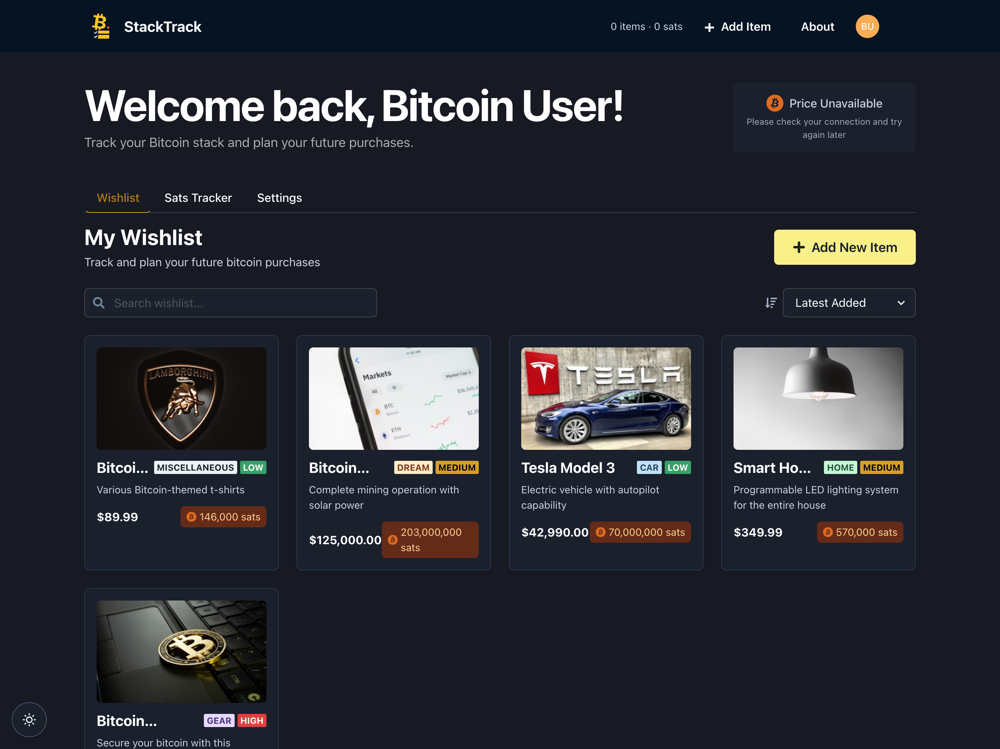

# 🟡 StackTrack

**Track your dreams. One sat at a time.**  
A privacy-first Bitcoin wishlist tracker, built for sovereignty and simplicity.  
Denominated in sats. Powered by NOSTR. Runs offline.

---

## 🚀 Features

- 🧾 Add wishlist items priced in fiat, auto-converted to sats
- 🔐 Login with [NOSTR](https://nostr.com) — no email, no passwords
- 🌐 Works offline-first with localStorage caching
- 📊 Bitcoin price fetched via [Block's Bitcoin Treasury API](https://github.com/block/bitcoin-treasury)
- 🌓 Light and dark modes with full responsiveness
- 📂 Organize items by category: Home, Car, Gear, Dream, Misc
- 🧼 Zero trackers, zero ads — just your stack and your goals

---

## 🧱 Tech Stack

- ⚛️ **React 19** + **TypeScript**
- ⚡ **Vite 6**
- 🎨 **Chakra UI**
- 🟡 **NOSTR** (via NDK)
- 📈 **Block API** (price data)
- 🔒 **LocalStorage** (offline + privacy-respecting)

---

## 📦 Getting Started

```bash
# Clone the repo
git clone https://github.com/CodeByMAB/StackTrack.git
cd StackTrack

# Install dependencies
npm install

# Start development server
npm run dev

# Build for production
npm run build
```

---

## 🧪 Offline + Testing

You can test offline functionality and login simulation directly from your browser:

### 🔧 Create Dummy Login
```js
const dummyPubkey = "npub1" + Array.from({length: 30}, () => 
  "0123456789abcdef"[Math.floor(Math.random() * 16)]).join('');

const dummyProfile = {
  name: "Test Stacker",
  about: "This is a test account for StackTrack development",
  picture: "https://api.dicebear.com/7.x/bottts/svg?seed=stacktrack"
};

localStorage.setItem('nostr_pubkey', dummyPubkey);
localStorage.setItem('nostr_profile', JSON.stringify(dummyProfile));
console.log('Test login created! Refresh the page to use it.');
```

### 💸 Set Dummy Bitcoin Price
```js
localStorage.setItem('stacktrack_bitcoin_price', JSON.stringify({
  usd: 62345.78,
  timestamp: Date.now() - 1000 * 60 * 20  // 20 minutes ago (expired)
}));
console.log('Dummy bitcoin price set in localStorage');
```

---

## 🛡️ Security Philosophy

- Your **keys are never stored**
- Only public data (like `npub` and avatar URL) are saved locally
- All data is stored client-side, with no backend required
- Input is sanitized to prevent XSS and malicious injection
- Offline-first = minimal network exposure

---

## 📸 Screenshots

### 🏠 Home Page


### 📊 Dashboard



---

## 🤝 Contributing

PRs welcome! Open an issue, fork the repo, and help us build the wishlist stacker Bitcoiners deserve.

---

## 📝 License

[MIT](./LICENSE)

---

> Built for Bitcoiners. Powered by open-source.  
> NOSTR in. Fiat out. Stack on. ⚡
